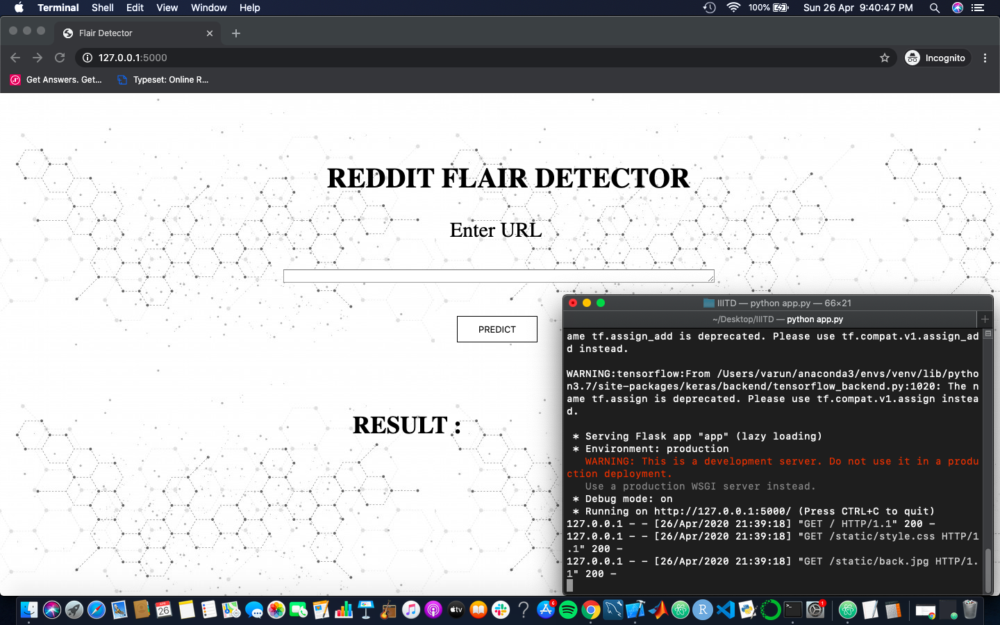
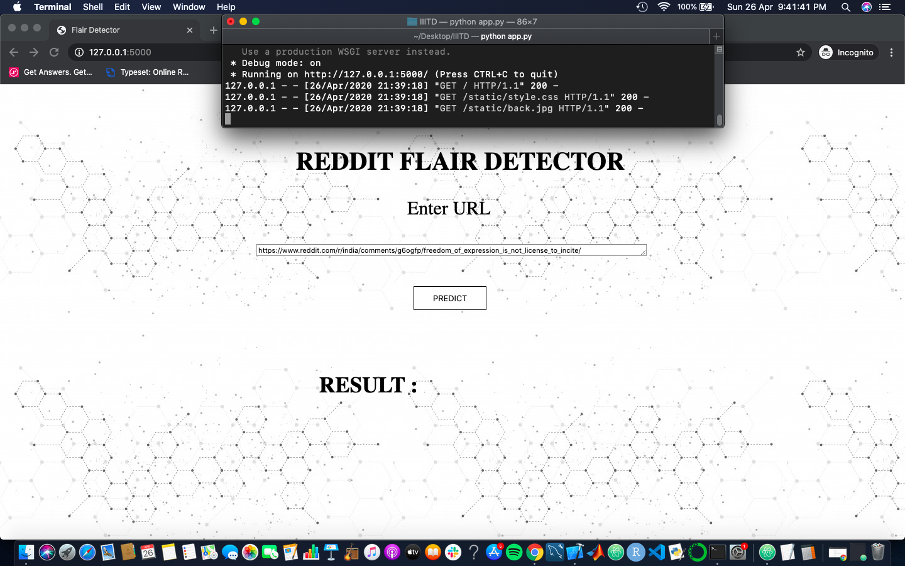
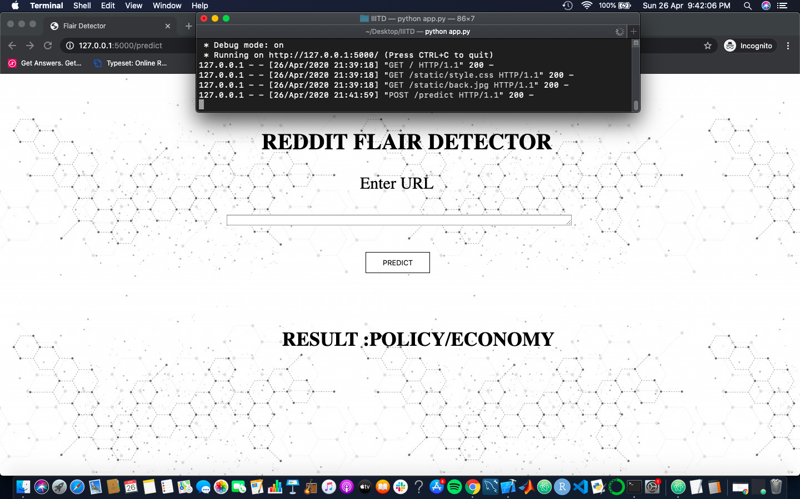
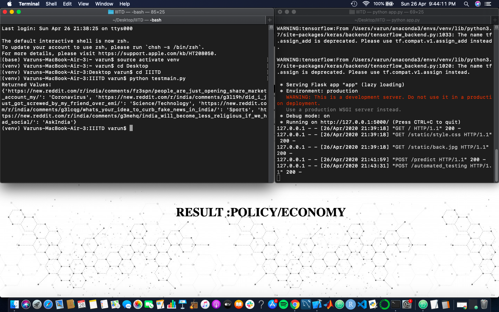

# Tools

Tensorflow (v1.15.0)

Keras (v2.2.5)

Nltk (stopwords, wordnet)

Seaborn

Matplolib

Wordcloud

Praw

Flask

HTML/CSS

Pickle

# Data Acquisition:
Notebook - reddit_data_acquisition.ipynb

Praw was used to access data from the subreddit r/india.
The following were the attributes utilised:

1)Flair

2)Title

3)Author

While building the application, these attributes we extracted using the url provided.
script - final.py

# Exploratory Data Analysis:
Notebook - EDA.ipynb
Matplotlib, Seaborn and Wordcloud were used.
Takeaway:

1) Most authors, with many submissions, made them with similar flairs. This motivated me to include it in the input sentence along with a seperator.

2) Submissions with flair 'politics' had the highest scores.

3) Initially, each flair had around 200 - 250 submissions making for a well balanced dataset.

4) Submissions with different flairs had similar character level distributions.

5) Submissions with each flair had some common words which was visualised using word cloud. For example:
- Submissions with flair 'Politics' had words 'Government','India','BJP', etc. occuring more often than others.

# Building Models (Training and Testing):
The following are the models I have trained on the data. I decided to stick to the one which gave the highest accuracy while describing how I overcame the various issues faced.

1)Multi channel CNN
 - Gave lower training as well as testing accuracy than the Stacked LSTM Model and therefore I decided to discontinue working on this model.

2)BERT - english, uncased(24, 1024, 16)
 - Gave similar validation accuracy as the initial Stacked LSTM Network but took 1.5 hours for each epoch and therefor I decided to discontinue working on this model.

3)Stacked LSTM Network:
 - Notebook - Final_LSTM.ipynb

 - Initial Issue: Overfitting (Training accuracy 95% but the validation accuracy would reach 40-45% and then decrease)
 - Solution:
    a) Used synonym based data augmentation to increase training data (Utilised wordnet(nltk))

    b) Introduced regularisers.(l1 and l2)

    c) Introduced and increased Dropout Rate.(Rate = 0.5)

    Validation Split = 0.1

    Final accuracy acheived:
    Training = 97.3%

    Validation = 91.8%
    
    Test = 90%
Note: For the purpose of security, I have removed the file for now until submission.
# Building a web application
script - final.py

Utilised praw to extract the features of the submission from the URL.

Created helper functions clean() and generate_flair() to predict flair from input features.

For automated testing, helper function extract() was used to extract the urls from the input .txt file.

Results were outputed in json format.

# Deploying the web application on Heroku
Could not deploy the application on heroku as it has a slug limit of 500MB whereas my model and tensorflow alone were 63 and 420MB alone. Considering the remaining dependencies the size went up to 550.2MB after removing the redundant ones.

Could not deploy the application on gcp due to "Error Response: [4] Timed out waiting for the app infrastructure to become healthy / ZONE_RESOURCE_POOL_EXHAUSTED ERROR"(https://issuetracker.google.com/issues/73583699)
After hopping a couple of zones in South, SouthEast, East and Northeast Asia for 5-6 hours as suggested as a plausible solution, it still gave no result.

I have shared screenshots of the application running on localhost, along with the execution of the .txt file for automated testing below:

Automated Testing:

